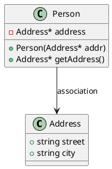
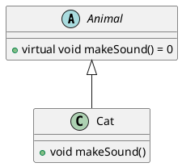
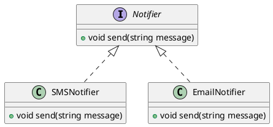
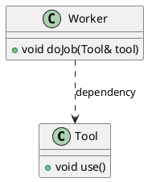
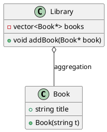
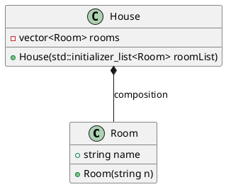
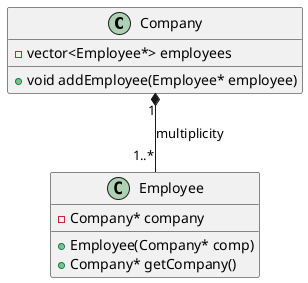

Reference: https://www.youtube.com/watch?v=XFkPGQ5MJ1Q
draw PlantUML online: https://plantuml-editor.kkeisuke.com/


1. **Class Diagrams**:
   - Each box labeled `Classname

` represents a class, with fields and methods inside.

2. **Class Member Visibility**:
   - `+` signifies a public member.
   - `-` signifies a private member.
   - `#` signifies a protected member.

3. **Specialized Classes**:
   - `<<abstract>> Classname` represents an abstract class.
   - `<<interface>> InterfaceName` represents an interface.
   - `<<enumeration>> EnumerationName` represents an enumeration.

These elements are commonly used in UML (Unified Modeling Language) diagrams to model the structure of software systems. If you need help with anything specific regarding


| **UML Relation Notation**    | **Diagram Symbol**                                           | **Example Classes**  | **Description**                                                    |
|------------------------------|-------------------------------------------------------------|----------------------|--------------------------------------------------------------------|
| **Association**              | ---                                                          | Person → Address     | Represents a relationship between two classes.                    |
| **Inheritance**              | ───▷                                                        | Cat ───▷ Animal      | Indicates that one class inherits from another class.             |
| **Realization/Implement**    | - - - ▷                                                     | SMSNotifier - - - ▷ Notifier | Shows that a class implements an interface.                   |
| **Dependency**               | - - - >                                                     | Worker - - - > Tool  | Indicates that one class depends on another.                      |
| **Aggregation**              | ─◇                                                          | Post ─◇ Image        | Indicates a whole-part relationship where the part can exist independently of the whole. |
| **Composition**              | ─◆                                                          | Post ─◆ Category     | Indicates a whole-part relationship where the part cannot exist independently of the whole. |
| **Multiplicity**             | 1..* ─── 1                                                  | Employee 1..* ─── 1 Company | Indicates the number of instances in a relationship.      |


### Association

**C++ Code:**
```cpp
class Address {
public:
    std::string street;
    std::string city;
};

class Person {
private:
    Address* address;
public:
    Person(Address* addr) : address(addr) {}
    Address* getAddress() { return address; }
};
```

**PlantUML Code:**



### Inheritance

**C++ Code:**
```cpp
class Animal {
public:
    virtual void makeSound() = 0; // pure virtual function
};

class Cat : public Animal {
public:
    void makeSound() override {
        std::cout << "Meow" << std::endl;
    }
};
```

**PlantUML Code:**


### Realization/Implementation

**C++ Code:**
```cpp
class Notifier {
public:
    virtual void send(std::string message) = 0;
};

class SMSNotifier : public Notifier {
public:
    void send(std::string message) override {
        std::cout << "Sending SMS: " << message << std::endl;
    }
};

class EmailNotifier : public Notifier {
public:
    void send(std::string message) override {
        std::cout << "Sending Email: " << message << std::endl;
    }
};
```

**PlantUML Code:**


### Dependency

**C++ Code:**
```cpp
class Tool {
public:
    void use() {
        std::cout << "Using tool" << std::endl;
    }
};

class Worker {
public:
    void doJob(Tool& tool) {
        tool.use();
    }
};
```

**PlantUML Code:**


### Aggregation

**C++ Code:**
```cpp
class Book {
public:
    std::string title;
    Book(std::string t) : title(t) {}
};

class Library {
private:
    std::vector<Book*> books; // Library contains a collection of pointers to books
public:
    void addBook(Book* book) {
        books.push_back(book);
    }
};
```

**PlantUML Code:**


### Composition

**C++ Code:**
```cpp
class Room {
public:
    std::string name;
    Room(std::string n) : name(n) {}
};

class House {
private:
    std::vector<Room> rooms; // House contains a collection of rooms
public:
    House(std::initializer_list<Room> roomList) : rooms(roomList) {}
};
```

**PlantUML Code:**


### Multiplicity

**C++ Code:**
```cpp
class Company {
private:
    std::vector<Employee*> employees;
public:
    void addEmployee(Employee* employee) {
        employees.push_back(employee);
    }
};

class Employee {
private:
    Company* company;
public:
    Employee(Company* comp) : company(comp) {}
    Company* getCompany() { return company; }
};
```

**PlantUML Code:**


To generate the UML diagrams, you can copy each PlantUML code snippet into an online PlantUML editor or any PlantUML tool to visualize them. This approach will help you see the diagrams accurately.
