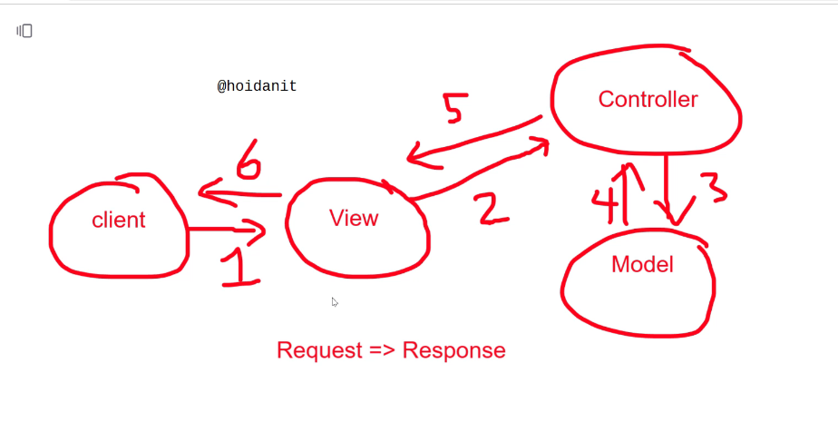
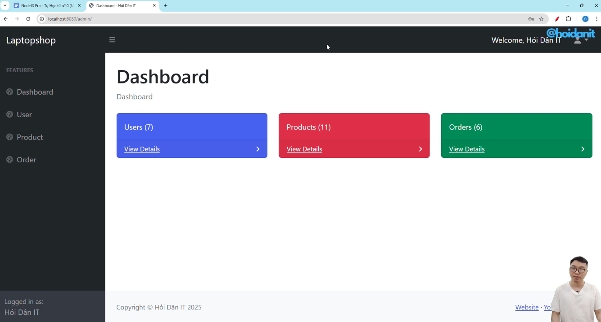
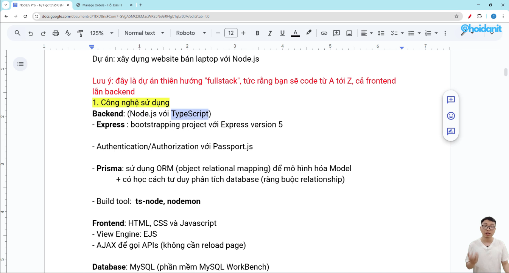
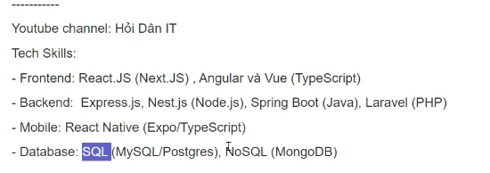

Current Course: https://myseco.udemy.com/course/hoidanit-backend-restful-api-from-zero/learn/lecture/48347397#overview

reference: https://myseco.udemy.com/course/hoidanit-backend-restful-api-from-zero/learn/lecture/53933381#overview

## Section 1: Demo









## Section 2 - Learn Typescript


ESNext: next version of JavaScript 

# Section 3:



Forward port from VM to localhost:


Init project
build all library 

npm init
```
htritai@ubuntu:~/Downloads/IT-Course/HoiDanIt/NodeJs-Pro$ npm init
This utility will walk you through creating a package.json file.
It only covers the most common items, and tries to guess sensible defaults.

See `npm help init` for definitive documentation on these fields
and exactly what they do.

Use `npm install <pkg>` afterwards to install a package and
save it as a dependency in the package.json file.

Press ^C at any time to quit.
package name: (nodejs-pro) 
version: (1.0.0) 
description: nodejs
entry point: (index.js) 
test command: temp
git repository: temp
keywords: temp
author: htritai
license: (ISC) 
type: (commonjs) 
About to write to /home/htritai/Downloads/IT-Course/HoiDanIt/NodeJs-Pro/package.json:

{
  "name": "nodejs-pro",
  "version": "1.0.0",
  "description": "nodejs",
  "main": "index.js",
  "scripts": {
    "test": "temp"
  },
  "repository": {
    "type": "git",
    "url": "temp"
  },
  "keywords": [
    "temp"
  ],
  "author": "htritai",
  "license": "ISC",
  "type": "commonjs"
}


Is this OK? (yes) yes

```

```
npm i --save-exact --save-dev typescript@5.7.3 @types/express@5.0.0 @types/node@22.10.7
```

```
npx tsc --init
```
Tạo file: tsconfig.json  tại root
{
  "compilerOptions": {
    "module": "commonjs",
    "esModuleInterop": true,
    "target": "es6",
    "sourceMap": true,
    "skipLibCheck": true,
    "outDir": "dist"
  }
}

```
cd /home/htritai/Downloads/IT-Course/HoiDanIt/NodeJs-Pro
npm install express
npm run dev

```

NOTE: normal website run on port 443


## Chapter 4 
npm i --save-exact --save-dev nodemon@3.1.9 ts-node@10.9.2

npm install --save-exact ejs@3.1.10
npm i --save-exact --save-dev @types/ejs@3.1.5


MVC - Model - View - Controller


# Chapter 5: use Database to save user
Install: 
Build:
Run:
Created `scripts/install-mysql-8.0.41.sh`.

Run it with:
```bash
./scripts/install-mysql-8.0.41.sh
```

If the exact version isn’t found, run:
```bash
apt-cache madison mysql-server | head -n 20
```
and I’ll adjust the script to match the available 8.0.41 build.

Create database:
1. Update `.env` with your DB settings:
```
DB_HOST=localhost
DB_USER=root
DB_PASSWORD=yourpassword123456
DB_NAME=nodejspro1
```
2. Run the script:
```bash
./scripts/create-database.sh
```
Note: On Ubuntu, `root` often uses `auth_socket`. If you get "Access denied for user 'root'@'localhost'", the script will try socket auth with `sudo`. You can also create a normal DB user and update `.env`:
```
DB_USER=nodeapp
DB_PASSWORD=nodeapp123
```

Create users table:
```bash
./scripts/create-users-table.sh
```

Seed fake users:
```bash
./scripts/seed-users.sh
```

## MySQL setup for Node.js (Ubuntu 20.04)
1. Install MySQL 8.0.41:
```bash
./scripts/install-mysql-8.0.41.sh
```
2. Fix repo key (if `apt update` fails with EXPKEYSIG):
```bash
sudo install -d -m 0755 /etc/apt/keyrings
wget -qO- https://repo.mysql.com/RPM-GPG-KEY-mysql-2023 | sudo gpg --dearmor -o /etc/apt/keyrings/mysql.gpg
```
3. Install client/server:
```bash
sudo apt-get update
sudo apt-get install -y mysql-client mysql-server
sudo systemctl enable --now mysql
```

## DB user for Node.js (avoid root auth_socket)
```bash
sudo mysql <<'SQL'
CREATE USER 'nodeapp'@'localhost' IDENTIFIED BY 'nodeapp123';
GRANT ALL PRIVILEGES ON nodejspro1.* TO 'nodeapp'@'localhost';
FLUSH PRIVILEGES;
SQL
```
Update `.env`:
```
DB_USER=nodeapp
DB_PASSWORD=nodeapp123
```

## Create database + table + fake data
```bash
./scripts/create-database.sh
./scripts/create-users-table.sh
./scripts/seed-users.sh
```

## Show all DBs and users table data
```bash
./scripts/show-db-info.sh
```

## Show table on home.ejs
Edit `src/views/home.ejs` to render a table. Example (static):
```html
<div style="margin: 25px">
  <div style="display: flex; justify-content: space-between; align-items: center;">
    <h1>List Users:</h1>
    <div>
      <a href="/create-user" class="btn btn-warning">Create a new user</a>
    </div>
  </div>
  <hr />
  <div>
    <table class="table table-hover table-bordered">
      <thead>
        <th>Company</th>
        <th>Contact</th>
        <th>Country</th>
      </thead>
      <tbody>
        <tr>
          <td>Alfreds Futterkiste</td>
          <td>Maria Anders</td>
          <td>Germany</td>
        </tr>
      </tbody>
    </table>
  </div>
</div>
```


